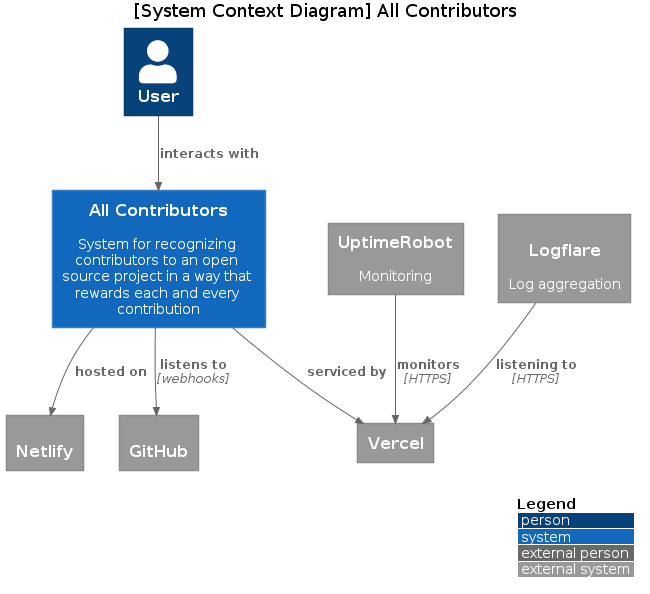
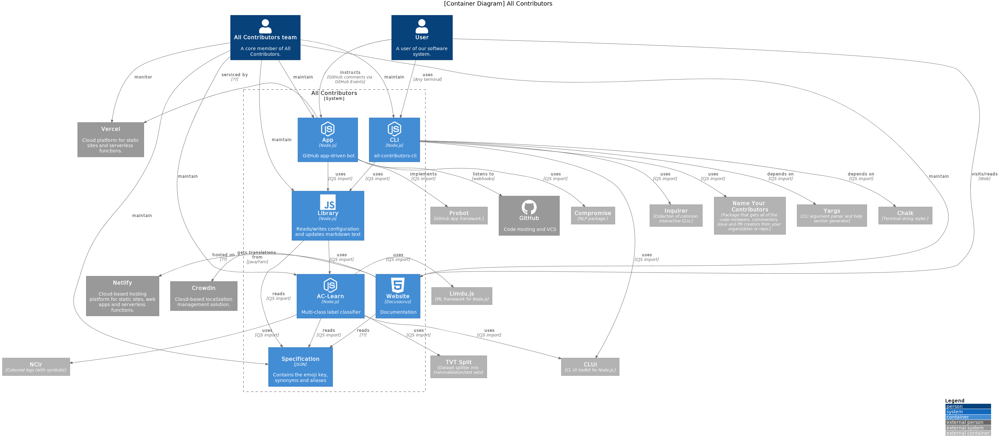

# All Contributors Software Architecture

This is a (potentially temporary) place where architectural diagrams of all the AC project can be found.

It's currently focused on the _new world_ (revamped) projects so it may not accurately illustrate the current systems.

<!-- ref: https://github.com/all-contributors/app/issues/329 -->

_**Notes**:_
-  The diagrams use the [C4 model](https://c4model.com/#CoreDiagrams).
-  Each containers (in the [C4 sense](https://c4model.com/#faq)) have their own repo (i.e. `1 container = 1 repo`).
- You need to have [PlantUML](https://plantuml.com/starting) installed to be able to generate the images and preview the diagrams (this can be done via IDE/editor extension too).

## System context

### AC System

#### CLI
TODO

#### Website
TODO

#### App
TODO

#### Library
TODO

#### AC-Learn
TODO

#### Specification
TODO

