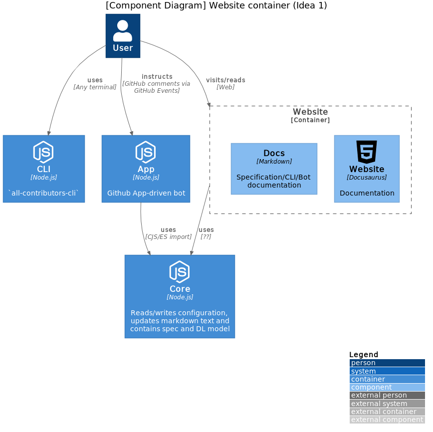

# All Contributors Software Architecture (Idea 1)

## System context

<h3>AC System</h3>

  

    View container diagram
  

  

  <h4>CLI</h4>
  

    

      View component diagram
      

    
  

  <h4>Website</h4>
  

    

      View component diagram
    

    
  

  <h4>App</h4>
  

    

      View component diagram
    

    TODO App_Component_Diagram
  

  <h4>Core</h4>
  

    

      View component diagram
      

    
  

